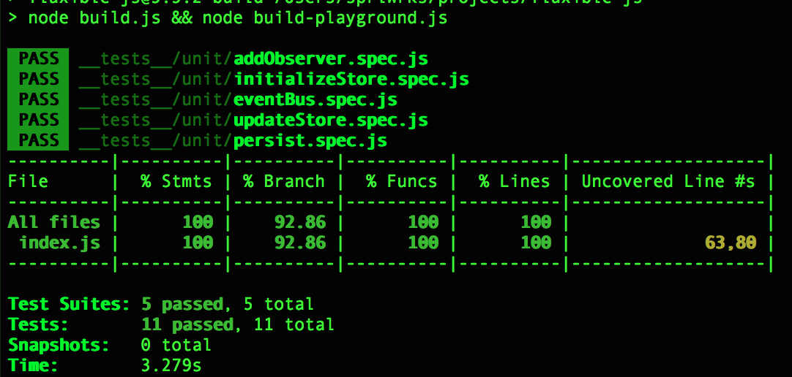
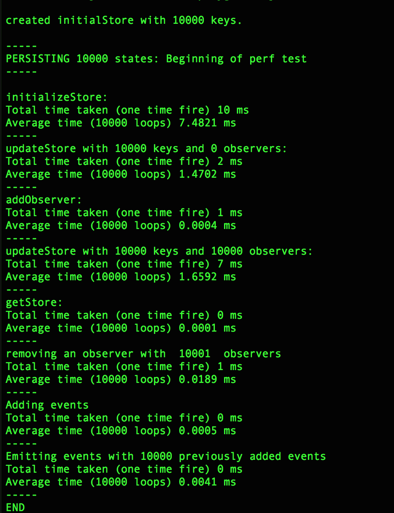
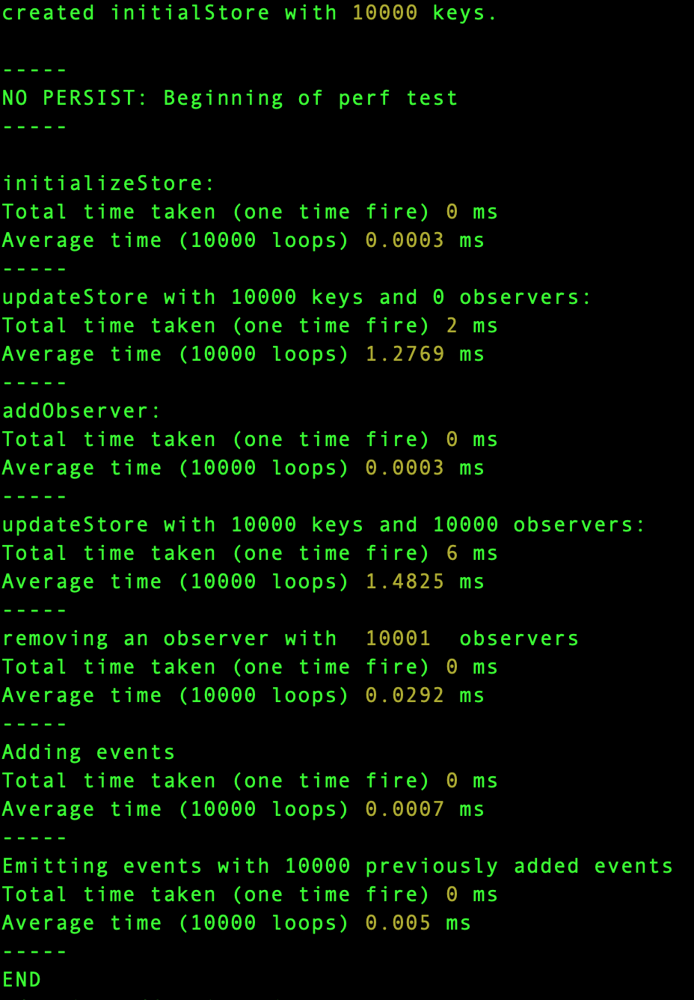

<!-- @format -->

# Fluxible-JS

Smaller, faster, better state management system that supports asynchronicity and state persistence out of the box.

# Change logs

From 5.0.10, the changelogs on the project will be kept in [CHANGELOG](./CHANGELOG.md), which follows [keepachangelog](https://keepachangelog.com/en/1.0.0/).

# Demo

[See demo](https://aprilmintacpineda.github.io/react-fluxible/). This demo is using [react-fluxible](https://github.com/aprilmintacpineda/react-fluxible).

# Tests

## Unit tests



## Performance tests with a store that has 10,000 keys

All performance test was ran on:

MacBook Pro (15-inch, 2016)
Processor: 2.7 GHz Quad-Core Intel Core i7
Memory: 16 GB 2133 MHz LPDDR3
Graphics: Radeon Pro 455 2 GB, Intel HD Graphics 530 1536 MB

**Complete disclosure**

These tests may or may not be accurate. Consider these to be the cases under the best circumstances though I tried to make these tests as harsh as possible in order to truly measure how fast it performs on not-so-good devices.

**With persist with (simulated storage)**



**With no persist**



---


###### I do not own the image you see above.

We developers are like cats. We like to fit ourselves inside a box. Sometimes the boxes we use are so small that our movements are so limited. Libraries are like boxes, basically, using a library is like saying:

> I like this box, I'm gonna use this box, I'm going to fit myself inside it.

Though libraries were not intended to limit but rather to extend our abilities, as time passes by, more advanced libraries tend to tie us so much to the pattern that it uses consequently limiting our abilities while at the same time extending it.

The goal of this state management library is to allow you to initialize, update, and share states while giving back the control to the developer. Think of it like a substantially bigger box.

# Run me

1. `git clone git@github.com:aprilmintacpineda/fluxible-js.git`
2. `npm i`
3. `npm run playground`

# Test me

- `npm run test-func` to run unit tests.
- `npm run test-perf` to run performance test.
- `npm run test` to run both.

# Install

`npm i -s fluxible-js`

# Building

Starting `4.0.0`, `fluxible-js` supported [code removal](#code-removal), which I encourage everyone to put to good use in order to save extra filesize and also performance, but it is completely optional and the library is still highly performant even without utilizing this.

Simply add the following to your build, under `module.rules`:

```js
{
  test: path.join(__dirname, '../node_modules/fluxible-js/src/'),
  use: [
    'babel-loader',
    /**
     * the following is optional and used for
     * on-build code removal
     */
    {
      loader: 'webpack-loader-clean-pragma',
      options: {
        pragmas: [
          {
            start: '/** @fluxible-config-use-JSON */',
            end: '/** @end-fluxible-config-use-JSON */'
          },
          {
            start: '/** @fluxible-no-synth-events */',
            end: '/** @end-fluxible-no-synth-events */'
          },
          {
            start: '/** @fluxible-config-sync */',
            end: '/** @end-fluxible-config-sync */'
          },
          {
            start: '/** @fluxible-config-persist */',
            end: '/** @end-fluxible-config-persist */'
          }
        ]
      }
    }
  ]
}
```

# Code removal

You will surely only be using some of the codes in this library. For example, if you are only using `asyncStorage`, the `syncStorage` becomes a dead code and is no longer necessary. Hence, it can be removed.

This library can work together with [webpack-loader-clean-pragma](https://github.com/aprilmintacpineda/webpack-loader-clean-pragma).

If you are using persist feature with `syncStorage`, copy-paste these pragmas:

```js
{
  start: '/** @fluxible-config-sync */',
  end: '/** @end-fluxible-config-sync */'
},
{
  start: '/** @fluxible-config-persist */',
  end: '/** @end-fluxible-config-persist */'
}
```

If you are using persist feature with `asyncStorage`, copy-paste these pragmas:

```js
{
  start: '/** @fluxible-config-async */',
  end: '/** @end-fluxible-config-async */'
},
{
  start: '/** @fluxible-config-persist */',
  end: '/** @end-fluxible-config-persist */'
}
```

Here are all the available pragmas, just copy-paste one or more of the following pragmas below:

**I don't use useJSON config option**:

Which means you need `JSON.parse` and `JSON.stringify`.

```js
{
  start: '/** @fluxible-config-use-JSON */',
  end: '/** @end-fluxible-config-use-JSON */'
}
```

**I am using useJSON config option**:

Which means you **don't** need `JSON.parse` and `JSON.stringify`.

```js
{
  start: '/** @fluxible-config-no-JSON */',
  end: '/** @end-fluxible-config-no-JSON */'
}
```

**I don't use persist feature**:

```js
{
  start: '/** @fluxible-config-no-persist */',
  end: '/** @end-fluxible-config-no-persist */'
}
```

**I am using persist feature**:

```js
{
  start: '/** @fluxible-config-persist */',
  end: '/** @end-fluxible-config-persist */'
}
```

**I don't use synthetic events feature**:

```js
{
  start: '/** @fluxible-no-synth-events */',
  end: '/** @end-fluxible-no-synth-events */'
}
```

**I am using asyncStorage**:

```js
{
  start: '/** @fluxible-config-async */',
  end: '/** @end-fluxible-config-async */'
}
```

**I am using syncStorage**:

```js
{
  start: '/** @fluxible-config-sync */',
  end: '/** @end-fluxible-config-sync */'
}
```

# Usage

## Initialize store

```js
import { initializeStore } from 'fluxible-js';

function getInitialStore() {
  return {
    user: null,
    someOtherState: 'value',
    anotherState: {
      value: 'value'
    }
  };
}

initializeStore({
  initialStore: getInitialStore(),
  persist: {
    useJSON: false,
    syncStorage: window.localStorage,
    restore: savedStore => ({
      user: savedStore.user
    })
  }
});
```

In the case above, only `user` would be saved and the rest wouldn't be saved.

`initializeStore` function expects an object as the only parameter, the object have a required property called `initialStore` which would be used as the initial value of the store. `initialStore` will be mutated every updates so it is ideal to call a function that returns the `initialStore`. This will allow you to reuse that function to get the `initialStore` throughout the life cycle of your application.

`persist` is an optional property which must also be an object containing the following properties:

- **REQUIRED**: `syncStorage` or `asyncStorage` must be a reference to the storage API that would be used to save the store. It must have `getItem` and `setItem` methods. Example would be `window.localStorage`. The call to `setItem` is deferred by 200ms, this is to minimize and to improve performance.
- **REQUIRED**: `restore` which must be a function that is synchronous. Restore will be called upon initialization and will receive the `savedStore` as the its only argument. The `savedStore` would be an object containing the states that were previously saved to the storage. If no item was previously saved, `getItem` is expected to return null, which will cause the `restore` to receive the store itself instead, which would be the initialStore at that moment. It must return an object which would be the states that you want to restore.
- **OPTIONAL**: `useJSON` can be set to `false` when you want to turn off calls to `JSON.stringify` (when saving the store to the storage) and `JSON.parse` (when initializing the store). This is when it's not necessary for the storage API that you are using.

Persist feature would only save keys that were returned by `config.persist.restore`. That means, other states that you did not return in that method wouldn't be saved. Persist will not fire every state update that you do. It checks if it needs to fire and it would only fire when you updated a state that you persisted.

`syncStorage` config option indicates that you are using a storage API that's `synchronous`. If you want to use a storage API that's asynchronous, e.g., [React-Native's AsyncStorage](https://facebook.github.io/react-native/docs/asyncstorage.html) or [localForage](https://github.com/localForage/localForage/), just specify `asyncStorage` in place of `syncStorage` like so:

```js
import { initializeStore } from 'fluxible-js';
import { AsyncStorage } from 'react-native';

initializeStore(
  {
    initialStore: {
      user: null,
      someOtherState: 'value',
      anotherState: {
        value: 'value'
      }
    },
    persist: {
      stringify: false,
      asyncStorage: AsyncStorage,
      restore: savedStore => ({
        user: savedStore.user
      })
    }
  },
  () => {
    console.log('initialization completed!');
  }
);
```

You should only specify either `syncStorage` or `asyncStorage`. Not both. The `asyncStorage` only supports [Promise API](https://developer.mozilla.org/en-US/docs/Web/JavaScript/Reference/Global_Objects/Promise).

When using `asyncStorage`, you can provide a 2nd argument which is a callback function that will be called after initialization has completed.

## Listen to store updates and getting the store

```jsx
import { addObserver, store } from 'fluxible-js';

const unsubscribeCallback = addObserver(() => {
  console.log('store has been updated!', store);
}, ['someOtherState', 'anotherState']);
```

**Do not mutate the store directly. Doing so may lead to unwanted behaviors in your app.**

`addObserver` expects a function as the argument. This function would be called every **AFTER** store updates.

The second argument is an array of strings which lists the names of the states that you are listening to, it's important that this list has the same name as the states you want to listen to. In the example above, I wanted to listen to `someOtherState` and `anotherState`, so every time one of those two gets updated my listener will be called.

`addObserver` returns a function that you can call later on to remove _that_ observer.

## Update the store

```js
import { updateStore } from 'fluxible-js';

updateStore({
  someOtherState: 'updated value'
});
```

**Do not mutate the store directly. Doing so may lead to unwanted behaviors in your app.**

## Performing asynchronous operation

The library itself does not restrict you to anything. You could use promises, async/await, or even generator functions (using generator function might require you to have your own implementation). The only thing that the library does is manage state, that would be updating the state and calling observers upon state update.

Example:

```js
import { updateStore } from 'fluxible-js';

function myAction() {
  updateStore({
    someOtherState: someValue
  });

  Axios.get(url, config).then(response => {
    // do what you need to do
    // then update the store when you're good.
    updateStore({
      someOtherState: someValue
    });
  });
}
```

# Event bus

## Adding events and event callbacks

`addEvent` is used both to add an event and to add a subscriber to an event. If the event doesn't exist yet, it will be created. The _first argument_ to the subscriber is the `payload`, which would be the 2nd argument passed to `emitEvent`. The _second argument_ is the name of the event that was emitted.

```js
import { addEvent } from 'fluxible-js';

addEvent('my-event', payload => {
  console.log('first listener', payload);
});

addEvent('my-event', payload => {
  console.log('second listener', payload);
});
```

There is also `addEvents` which accepts an array of events you want your callback to listen to. This is specially useful when you want to also remove this event with only one function call. So you can turn this:

```js
const eventListenerCallback = payload => {
  console.log(payload);
};

const createdListener = addEvent('recordCreated', eventListenerCallback);
const editedListener = addEvent('recordEdited', eventListenerCallback);

// remove created listener
createdListener();
// remove edited listener
editedListener();
```

into this:

```js
const removeListener = addEvents(['recordCreated', 'recordEdited'], payload => {
  console.log(payload);
});

// to remove the events callback above
// this will remove it for both 'recordCreated' and 'recordEdited'
removeListener();
```

## Removing event callbacks

`addEvent` returns a callback function that you can call when you want to remove that listener from the event it's listening to. This callback returns `-1` when the listener was not found from the event OR the event itself does not exists.

```js
import { addEvent, removeEvent } from 'fluxible-js';

const listener1 = addEvent('my-event', () => {
  console.log('first listener', payload);
});
const listener2 = addEvent('my-event', () => {
  console.log('second listener', payload);
});

console.log(listener1());
console.log(listener2());

console.log(listener1()); // -1
console.log(listener2()); // -1

const listener3 = addEvent('my-event-3', () => {
  console.log('my event 3 listener', payload);
});

removeEvent('my-event-3');
console.log(listener3()); // -1
```

`addEvents` returns a callback function that you can call to remove that listener from the events it's listening to. This callback does not return anything.

```js
const removeListener = addEvents(['recordCreated', 'recordEdited'], payload => {
  console.log(payload);
});

// to remove the events callback above
// this will remove it for both 'recordCreated' and 'recordEdited'
removeListener(); // undefined
```

## Removing an event

`removeEvent` expects only one parameter, which is the event that would be removed. If the event provided does not exists, it will return `-1`.

```js
import { removeEvent } from 'fluxible-js';

function listener1(payload) {
  console.log('first listener', payload);
}

addEvent('my-event', listener1);

if (removeEvent('my-event') !== -1) {
  console.log('successfully removed event.');
}
```

there is also `removeEvents` which does the same thing but accepts an array of events to be removed, so you can turn this:

```js
removeEvent('my-event');
removeEvent('my-other-event');
removeEvent('even-more-event');
```

into this:

```js
removeEvents(['my-event', 'my-other-event', 'even-more-event']);
```

## Emitting events

`emitEvent` expects the first argument to be the event that would be emitted. The second argument to be anything (primitive or non-primitive), which would be treated as the payload to be given to all the callbacks subscribed to that event. If the event does not exists, it will return `-1`.

```js
import { emitEvent, addEvent, updateStore } from 'fluxible-js';

function listener1(payload) {
  updateStore({
    newValue: payload.newValue
  });

  removeListener1(); // I'm done. Removing myself.
}

const removeListener1 = addEvent('my-event', listener1);

const payload = {
  value: 1,
  anotherValue: 2
};

emitEvent('my-event', payload);
```

There is also `emitEvents` which does the same thing as `emitEvent`, except it accepts an array of events to be emitted with the specified payload. So you can turn this:

```js
const payload = {
  value: 1,
  anotherValue: 2
};

emitEvent('my-event', payload);
emitEvent('my-other-event', payload);
emitEvent('even-more-event', payload);
```

into this:

```js
emitEvents(['my-event', 'my-other-event', 'even-more-event'], {
  value: 1,
  anotherValue: 2
});
```

# Contributing

Discussions, questions, suggestions, bug reports, feature request, etc are all welcome. Just create an issue.
