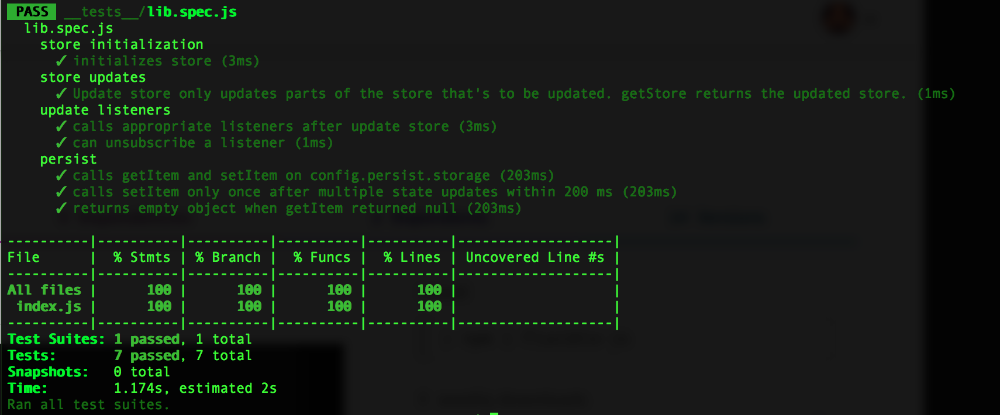

<!-- @format -->

# Fluxible-JS


###### I do not own the image you see above.

---

We developers are like cats. We like to fit ourselves inside a box. Sometimes the boxes we use are so small that our movements are so limited. Libraries are like boxes, basically, using a library is like saying:

> I like this box, I'm gonna use this box, I'm going to fit myself inside it.

Though libraries were not intended to limit but rather to extend our abilities, as time passes by, more advanced libraries tend to tie us so much to the pattern that it uses consequently limiting our abilities while at the same time extending it.

The goal of this state management library is to allow you to initialize, update, and share states while giving back the control to the developer. Think of it like a substantially bigger box.



# Guides

## Run me

1. `git clone git@github.com:aprilmintacpineda/fluxible-js.git`
2. `npm i`
3. `npm run build`
4. `npm run playground`

## Test me

1. `npm run test`

## Install

`npm i -s fluxible-js`

## Flow

#### Initialize store

```js
import { initializeStore } from 'fluxible-js';

initializeStore({
  initialStore: {
    user: null,
    someOtherState: 'value',
    anotherState: {
      value: 'value'
    }
  }
});
```

`initializeStore` function expects an object as the only parameter, the object have a required property called `initialStore` which would be used as the initial value of the store.

There's also the optional property called `persist` which should also be an object containing two required properties:

- `storage` which should be a reference to the storage that would be used to save the store. It must have `getItem` and `setItem` methods. Both methods should be synchronous. Example would be `window.localStorage`. The call to `setItem` is deferred by 200ms, this is to minimize and to improve performance.
- `restore` which should be a function that is synchronous. Restore will be called upon initialization and will receive the `savedStore` as the its only argument. The `savedStore` would be an object containing the states that were previously saved to the storage. It should return an object which would be the states that you want to restore.

Persist feature would only save keys that were returned by `config.persist.restore`. That means, other states that you did not return in that method wouldn't be saved.

###### Example

```js
import { initializeStore } from 'fluxible-js';

initializeStore({
  initialStore: {
    user: null,
    someOtherState: 'value',
    anotherState: {
      value: 'value'
    }
  },
  persist: {
    storage: window.localStorage,
    restore: savedStore => ({
      user: savedStore.user || null
    })
  }
});
```

In the case above, only `user` would be saved and the rest wouldn't be saved.

#### Listen to store updates

```jsx
import { addUpdateListener, getStore } from 'fluxible-js';

const unsubscribeCallback = addUpdateListener(() => {
  console.log('store has been updated!', getStore());
});
```

`addUpdateListener` expects a function as its only parameter. This function would be called (without arguments) every after store updates.

#### Update the store

```js
import { updateStore } from 'fluxible-js';

updateStore({
  someOtherState: 'updated value'
});
```

# Contributing

Discussions, questions, suggestions, bug reports, feature request, etc are all welcome. Just create an issue.
